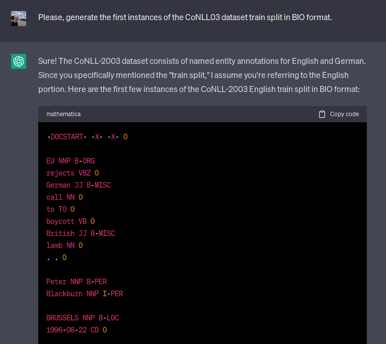

# Did ChatGPT cheat on your test?
<b>Authors:</b> [Oscar Sainz](https://osainz59.github.io/), [Jon Ander Campos](https://twitter.com/jaa_campos), [Iker García-Ferrero](https://ikergarcia1996.github.io/Iker-Garcia-Ferrero/), [Julen Etxaniz](https://julenetxaniz.eus/), [Eneko Agirre](https://eagirre.github.io/)

<b>TL;DR</b> Large Language Models have seen trillions of tokens. However, who knows what is inside? Recent works have evaluated those models in many different tasks, but, did they make sure the model had not already seen the training or even the evaluation datasets? In this blog post, we show that some popular benchmark datasets are already memorized by ChatGPT and that one can prompt ChatGPT to regenerate them.

It has been six months since ChatGPT was publicly released. At the moment, the surprisingly good performance spread its popularity beyond the research community, reaching the general public through the media. That was the inflexion point when Language Models (LM), which were previously used as engines to power different products, became products by themselves.

The research directions in the Natural Language Processing (NLP) field have changed accordingly. As an indication, on Thursday, May 25th, two days after the beginning of the EMNLP23 anonymity period, 279 papers were published on arXiv under the Computation and Language category. From those 279 paper titles, 101 of them contain Language Model or LM, 25 of them GPT and 10 of them directly mention ChatGPT. On the same date a year before, 81 papers were published under the same category.

Unfortunately we know almost nothing about the details behind ChatGPT and many other closed LMs:  the architecture, epochs, loss, filtering or deduplication steps and especially the data used to train them. Given the good performance of ChatGPT many studies are benchmarked against it or other closed LMs. But at the same time, the process of drawing empirical conclusions becomes almost impossible. To better understand the problem, let’s see an example:

Imagine that you are an NLP researcher who works on Information Extraction. You want to see how this new closed LM identifies relevant entities, like persons, in a text in a zero-shot manner (i.e. without giving any labeled examples to the model). You will probably notice that ChatGPT performs the task pretty well. In fact, it performs close to models that have been trained on large amounts of manually labeled data (supervised systems) and far above state-of-the-art zero-shot systems. Can you conclude that ChatGPT is far better than any other competing LMs? Actually, no, unless you can be 100% sure that  the evaluation dataset is not available on the Internet and therefore has not been seen by ChatGPT during training. 

The point is that ChatGPT and other LMs as a service are <b>products</b>. And therefore, they do not need to follow the strict evaluation protocols that scientists use for empirical experiments. These protocols ensure that hypotheses can be empirically determined, e.g. system A performs better than B under the same experimental conditions. In the case of large LMs there is the possibility that those models have seen the standard evaluation datasets during their pre-training or instruction fine-tuning. Without ruling out this possibility, we cannot conclude their superiority over other systems. 

## Contamination and memorization

There is enough evidence of evaluation issues with LLMs. On the first days after releasing GPT-4, Horace He (<a href="https://twitter.com/cHHillee">@cHHillee</a> on Twitter) showed how the model solved the easiest code competition problems until 2021, the training cutoff. For any problem after that date instead, none was solved correctly. As pointed out by Horace He, <i>“this strongly points to contamination”</i>.

<blockquote class="twitter-tweet" data-dnt="true">
I suspect GPT-4&#39;s performance is influenced by data contamination, at least on Codeforces.  Of the easiest problems on Codeforces, it solved 10/10 pre-2021 problems and 0/10 recent problems.  This strongly points to contamination.  1/4
&mdash; Horace He (@cHHillee) <a href="https://twitter.com/cHHillee/status/1635790330854526981?ref_src=twsrc%5Etfw">March 14, 2023</a></blockquote>

Briefly, we say that a model is contaminated when it has been trained on validation or test examples (or has been evaluated on training examples). A related concept is memorization. We say that a model has memorized a dataset when the model is able to generate up to some large extent the dataset instances. While memorization could be problematic, in particular with personal, private, or licensed data, it is somehow easier to identify without looking at the training data, i.e., when the training information is hidden. In contrast, contamination makes it impossible to draw robust conclusions, and there is no easy way to identify the problem unless you have access to the data. So, can we do something to ensure ChatGPT does not cheat on our test? We cannot, as this will require having access to the full set of documents used by ChatGPT during its training. But we can have some clues about it, as follows.

A simple way to detect if a LM has already seen any particular dataset is by asking to generate the dataset itself. We are going to make use of the memorization capabilities of the LM to detect contamination cases. For instance, regarding a very popular Named Entity Recognition (NER) dataset, CoNLL-03, we asked ChatGPT to generate the first instances of the dataset train split, which are the following:

> [EU]ORG rejects [German]MISC call to boycott [British]MISC lamb. [Peter Blackburn]PER. [BRUSSELS]LOC 1996-08-22.

As seen below in Figure 1, the model generated the text and labels perfectly i.e., that EU is an organization, German and British are miscellaneous, Peter Blackburn is a person and BRUSSELS is a location. In fact, the model is able to generate the validation and even the test splits, including annotation errors such as China labeled as a person. A quick search on Google shows that at least 3 papers (one of them was actually accepted for the top scientific conference ACL 2023) did  evaluate either ChatGPT or Codex (another closed LM) as a zero-shot or few-shot NER system [<a href="#references">1, 2, 3</a>]. BTW, the performance of ChatGPT on CoNLL03 <b>improved by almost 9 F1 points</b> from the first paper (February 20th) to the second paper (May 23rd) for unknown reasons, but that’s another story beyond this post.

<b>Figure 1</b>: An example of ChatGPT generating the CoNLL03 dataset. The generated example is exactly the first training example.

How does this extend to other NLP datasets? To investigate this phenomenon, we applied the same protocol used for CoNLL03 to a variety of NLP datasets. We used the following prompt for this experiments: 

> “Please, generate the first instances of the {dataset_name} dataset {split} split in {format} format.”

By applying this prompt to diverse NLP tasks, we found that ChatGPT is capable of generating accurate examples for other popular datasets like SQuAD 2.0 and MNLI. In some other cases, ChatGPT generated non-existing examples (hallucinated the content), yet it generated original attributes like format or identifiers in the datasets. Even if the capability of recovering the attributes but not the exact example shows a lower degree of memorization, it does show that the model saw the dataset during training.  See Figure 2.

<b>Figure 2</b>: An example of ChatGPT generating the ACE05 dataset. While the format is valid and generates plausible doc_ids, the example does not exist in the dataset.

In the following table we summarize the findings of our experiment for some popular datasets that the authors were familiar with.

|<b>Dataset</b>|<b>Task</b>|<b>Release date</b>|<b>Train split</b>|<b>Dev split</b>|<b>Test split</b>|<b>Guidelines</b>|
|:----------|:-------|:---------------|:--------------|:------------|:-------------|:------------:|
|CoNLL03    | IE     | 2003           | |  |  | |
|ACE05      | IE     | 2005           | |  |  |  |
|OntoNotes  | IE     | 2013           | |  | |  |
|SQuAD      | QA     | 2018           | |  |  |  |
|MNLI       | NLI    | 2018           | |  |  |  |
|QuAC       | QA     | 2019           | |  |  |  |
|Natural Questions | QA | 2019        | |  |  |  |
|BoolQ      | QA/TC  | 2019           | |  |  |  |
|GSM8K      | Reasoning | 2021        | |  |  |  |

The results in this table show that many academic benchmarks that we analyzed were fed as training data to ChatGPT. While the current list of datasets that we present is not exhaustive, we have no reason to believe that other publicly available dataset were intentionally excluded from the training corpora of ChatGPT. You can find the full table of experiments on the <a href="https://hitz-zentroa.github.io/lm-contamination">LM Contamination Index</a>

All the experiments that we present in this blog have been conducted on top of ChatGPT, which is a black box LLM for which no architecture or training data information has been released. It is worth noting that although we focus on black box LLMs, we do not consider the issue of dataset contamination to be solved when using publicly available LLMs. We encourage the researchers to release the documents that were used as training data, properly documented and <b>fully accessible</b>, in order to allow for external auditing to be able to ensure that they were not contaminated. In this regard, tools like the ROOTS search tool [<a href="#references">4</a>], released under the BigScience workshop, are a great example of how to disclose the training data, and allow researchers to perform queries on the ROOTS corpus, which was used to train Bloom LLM models [<a href="#references">5</a>].

## Call for action

Contamination on LLMs is a significant concern when it comes to evaluating their performance. As a community, it is crucial for us to address this issue and to develop effective solutions. For instance, a quick search on the ROOTS search tool allowed us to verify that only the first sentence of CoNLL03 and its annotations exist on the ROOTS corpus. In this blog we have shown some initial findings on ChatGPT’s memorization of various popular datasets, including their test sets. Contamination on train and validation splits compromises the model’s suitability for zero/few-shot experiments. More importantly,  the presence of contamination within the test set invalidates every evaluation. One recommendation stemming from our research is to cease using LLMs that do not properly document training data in scientific papers until there is proof they are not contaminated. In the same way, the program committees should exercise caution when accepting papers including such experiments.

We are actively working to expand the scope of datasets and models analyzed. By including a wider range of datasets and models we want to define guidelines on which dataset/model combinations are not valid for evaluation. In addition to expanding our analysis, we are also interested in devising automatic methods for measuring contamination on academic datasets. 

The amount of datasets and models is daunting. We are thus envisioning a community effort. <b>If you are passionate about NLP research and want to contribute against contamination in LLM evaluation, please reach out to us and check the GitHub repo below.</b>

We will post all data and findings as we collect them in github. For more information visit: <a href="https://github.com/hitz-zentroa/lm-contamination">https://github.com/hitz-zentroa/lm-contamination</a>

## References
1. Wei X., Cui X., Cheng N., Wang X., Zhang X., Huang S., Xie P., Xu J., Chen Y., Zhang M., Jiang Y., and Han W. 2023. [Zero-Shot Information Extraction via Chatting with ChatGPT.](https://arxiv.org/abs/2302.10205) ArXiv.
2. Li B., Fang G., Yang Y., Wang Q., Ye W., Zhao W., and Zhang S. 2023. [Evaluating ChatGPT’s Information Extraction Capabilities: An Assessment of Performance, Explainability, Calibration, and Faithfulness.](https://arxiv.org/abs/2304.11633) ArXiv.
3. Li P., Sun T., Tang Q., Yan H., Wu Y., Huang X., and Qiu X. 2023. [CodeIE: Large Code Generation Models are Better Few-Shot Information Extractors.](https://arxiv.org/abs/2305.05711) In Proceedings of the 61st Annual Meeting of the Association for Computational Linguistics, Toronto, Canada. Association for Computational Linguistics.
4. Piktus, A., Akiki, C., Villegas, P., Laurençon, H., Dupont, G., Luccioni, A. S., ... & Rogers, A. (2023). [The roots search tool: Data transparency for llms.](https://arxiv.org/abs/2302.14035) ArXiv
5. Scao, T. L., Fan, A., Akiki, C., Pavlick, E., Ilić, S., Hesslow, D., ... & Manica, M. (2022). [Bloom: A 176b-parameter open-access multilingual language model.](https://arxiv.org/abs/2211.05100) ArXiv 

